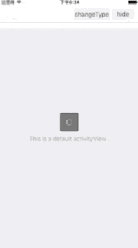
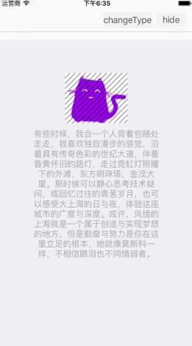
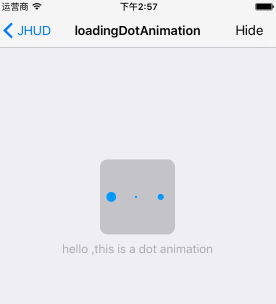
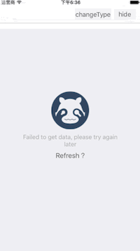
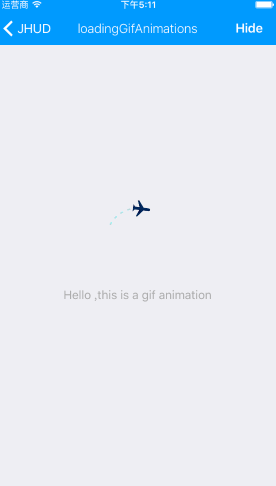
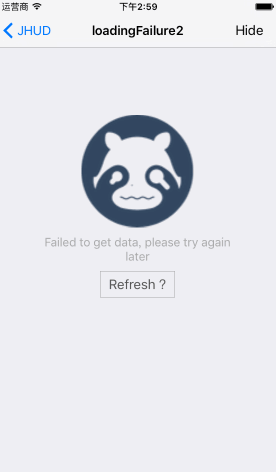

# JHUD

[](http://cocoapods.org/pods/JHUD)
[](http://cocoapods.org/pods/JHUD)
[](http://cocoapods.org/pods/JHUD)
[](https://www.apple.com/nl/ios/)&nbsp;
[](http://weibo.com/3205872327)
[](https://github.com/jinxiansen/JHUD/stargazers)

####`JHUD` is a full screen of the HUD when loading the data (Objective-C) .

####  **Chinese (Simplified)**: 
####[中文说明](README.zh.md)
######[简书介绍](http://www.jianshu.com/p/fc07f027680c)
<!--<iframe frameborder="no" border="0" marginwidth="0" marginheight="0" width=330 height=86 src="http://music.163.com/outchain/player?type=2&id=29947420&auto=1&height=66"></iframe>-->
 
##screenshots









## Requirements

`JHUD` works on "Xcode 7.3 , iOS 6+  and requires ARC to build. 
You will need the latest developer tools in order to build `JHUD`. Old Xcode versions might work, but compatibility will not be explicitly maintained.


##CocoaPods

CocoaPods is the recommended way to add JHUD to your project.

Add a pod entry for JHUD to your Podfile.
 
```
pod 'JHUD'
```
Second, install JHUD into your project:
 
```
pod install
```
Include JHUD wherever you need it with `#import "JHUD.h"`.

## Manually

1. Download the latest code version .
2. Open your project in Xcode,drag the `JHUD` folder into your project.  Make sure to select Copy items when asked if you extracted the code archive outside of your project.
3. You need it with `#import "JHUD.h"`.


## Usage

```
hudView = [[JHUD alloc]initWithFrame:self.view.bounds];

hudView.messageLabel.text = @"hello ,this is a circle animation";

//show
[hudView showAtView:self.view hudType:JHUDLoadingTypeCircle];

//hide 
[hudView hide];
```

Class method :

```
[JHUD showAtView:self.view message:@"Hello, this is a message"];

[JHUD hide];
```

For more examples, including how to use JHUD , take a look at the bundled demo project. API documentation is provided in the header file (JHUD.h).

## Contacts

####If you wish to contact me, email at: hi@jinxiansen.com

#####Sina : [@晋先森](http://weibo.com/3205872327)
#####Twitter : [@jinxiansen](https://twitter.com/jinxiansen)

## License

JHUD is released under the [MIT license](LICENSE). See LICENSE for details.