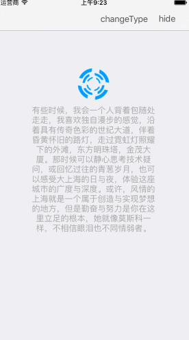

# JHUD

####`JHUD` is a full screen of the HUD when loading the data (Objective-C) .


  
 
 
 


## Requirements

`JHUD` works on "Xcode 7.3 , iOS 6+  and requires ARC to build. 
You will need the latest developer tools in order to build `JHUD`. Old Xcode versions might work, but compatibility will not be explicitly maintained.

### Source files

Alternatively you can directly add the `JHUD.h` and `JHUD.m` source files to your project.

1. Download the latest code version .
2. Open your project in Xcode, then drag and drop `JHUD.h` and `JHUD.m` onto your project. Make sure to select Copy items when asked if you extracted the code archive outside of your project.
3. Include JHUD wherever you need it with `#import "JHUD.h"`.


## Usage

```
hudView = [[JHUD alloc]initWithFrame:self.view.bounds];

hudView.messageLabel.text = @"This is a default activityView .";

//show
[hudView showAtView:self.view hudType:JHUDLoadingTypeActivity];

//hide 
[hudView hideHudView];

```

For more examples, including how to use JHUD , take a look at the bundled demo project. API documentation is provided in the header file (JHUD.h).


##中文说明
####`JHUD` 是一个加载数据时用于全屏显示的HUD，使用Objective-C编写.

##须知
`JHUD` 基于 "Xcode 7.3 , iOS 6+ 和ARC环境下完成的，请使用最新正式版来编译JHUD,旧版本的Xcode可能有效，但不保证会出现一些兼容性问题。

##手动安装
1. 通过 Clone or download 下载最新版。
2. 将`JHUD.h`和`JHUD.m`源文件添加在你的项目之中。
3. 导入`JHUD.h` 。

##使用

```
hudView = [[JHUD alloc]initWithFrame:self.view.bounds];

hudView.messageLabel.text = @"This is a default activityView .";

//显示
[hudView showAtView:self.view hudType:JHUDLoadingTypeActivity];

//隐藏 
[hudView hideHudView];

```

更多的使用用例可以看Demo工程演示以及头文件(JHUD.h)。


## Contacts

####If you wish to contact me, email at: hi@jinxiansen.com

#####Tencent QQ: 463424863
#####新浪微博 : [@晋先森](http://weibo.com/3205872327/)
#####Twitter : [@jinxiansen](https://twitter.com/jinxiansen)

## License

JHUD is released under the [MIT license](LICENSE). See LICENSE for details.