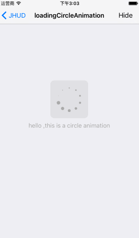
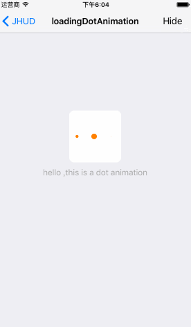
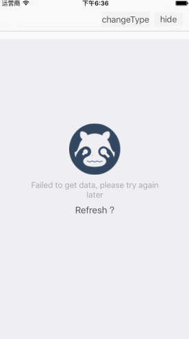
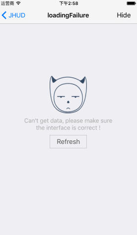

# JHUD

####`JHUD` is a full screen of the HUD when loading the data (Objective-C) .

####  **Chinese (Simplified)**: [中文介绍](README.zh.md)
 
##screenshots

  
 
 
 
 
 


## Requirements

`JHUD` works on "Xcode 7.3 , iOS 6+  and requires ARC to build. 
You will need the latest developer tools in order to build `JHUD`. Old Xcode versions might work, but compatibility will not be explicitly maintained.

### Manually

1. Download the latest code version .
2. Open your project in Xcode,drag the `JHUD` folder into your project.  Make sure to select Copy items when asked if you extracted the code archive outside of your project.
3. You need it with `#import "JHUD.h"`.


## Usage

```
hudView = [[JHUD alloc]initWithFrame:self.view.bounds];

hudView.messageLabel.text = @"hello ,this is a circle animation";

//show
[hudView showAtView:self.view hudType:JHUDLoadingTypeCircle];

//hide 
[hudView hide];

```

Class method 

```
[JHUD showAtView:self.view message:@"Hello, this is a message"];

[JHUD hide];

```

For more examples, including how to use JHUD , take a look at the bundled demo project. API documentation is provided in the header file (JHUD.h).

## Contacts

####If you wish to contact me, email at: hi@jinxiansen.com

#####Sina : [@晋先森](http://weibo.com/3205872327/)
#####Twitter : [@jinxiansen](https://twitter.com/jinxiansen)

## License

JHUD is released under the [MIT license](LICENSE). See LICENSE for details.